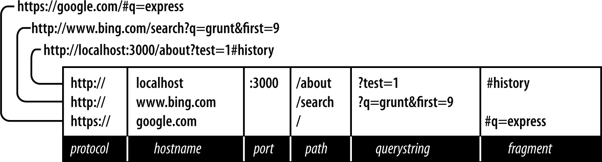

# Web Development with Node and Express

## Unit Testing 

### Mocking 

- Code that tries to do too much or assumes a lot of dependencies is harder to test than focused code that assumes few or no dependencies. 

- Whenever you have a dependency, you have sth that needs to be mocked (simulated) for effective testing. 
= The routes we currently have are pretty difficult to test b/c they assume three dependencies on Express: they assume we have an Express app(so we can have `app.get`), as well as request and response objects. 
- It's easy to eliminate the dependencies on the Express app itself (the request and response objects are harder). 
- If you're not using much functionality from the response object (only using the `render` method), it will be easy to mock it. 
  
### Refactoring the Application for Testability

- To make the app more testable, extract the actual route handlers to their own library. Create a file `lib/handlers.js`. 
```js
import { getFortune } from "./fortune";

export function home(req, res) {
  return res.render("home");
}

export function about(req, res) {
  return res.render("about", { fortune: getFortune() });
}

export function notFound(req, res) {
  res.render("404");
}

export function serverError(err, req, res, next) {
  res.render("500");
}
```
Now, rewrite `meadowlark.js` app file to use these handlers. 
```js
// typically at the top of the file

import handlers from "./lib/handlers"

app.get('/', handlers.home)
app.get('/about', handlers.about)
// custom 404 page
app.use(handlers.notFound)
// custom 500 page
app.use(handlers.serverError)
```
It is easier to test those handlers: they are just functions that take request objects and response objects. We need to verify that we're using those objects correctly. 
>> Q. what is 'any' when I hover over a function?

### Writing our first test 

## Continuous Integration 

- CI is a QA concept.
- CI runs some or all of your tests every time you contribute code to a source code repository (you can control which branches this applies to). 
- If all of the tests pass, nothing usually happens (depending on how CI is configured). 
- If there are failures, depending on how you configure your CI, the entire team gets an email saying that you "broke the build". 
  
- Travis CI for Node projects. 
- It's a hosted solution (saves you from having to set up your own CI server). It offers integration support if you use GitHub. 
- CircleCI is also an option. 

# Chapter 6. The Request and Response objects 

- Building a web server with Express starts with a request object and ends with a response object. These two originate in Node and are extended by Express. 

## The Parts of a URL 


**Protocol**
Determines how the request will be transmitted. 
- ***http, https, file, ftp***

**Host**
- The host identifies the server. 
- Servers on your computer: localhost
- Local networks may be identified simply by one word or by numeric IP address. 
- On the internet, the host will end in a top-level domain (TLD) like ***.com*** or ***.net***
- There may be ***subdomains***, which prefix the hostname. 
- `www` is a common subdomain, though it can be anything. They are optional. 

**Port**
